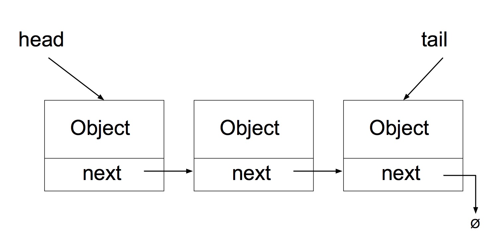
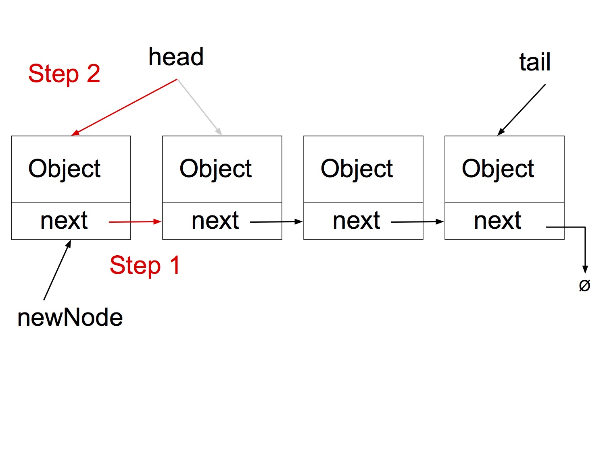
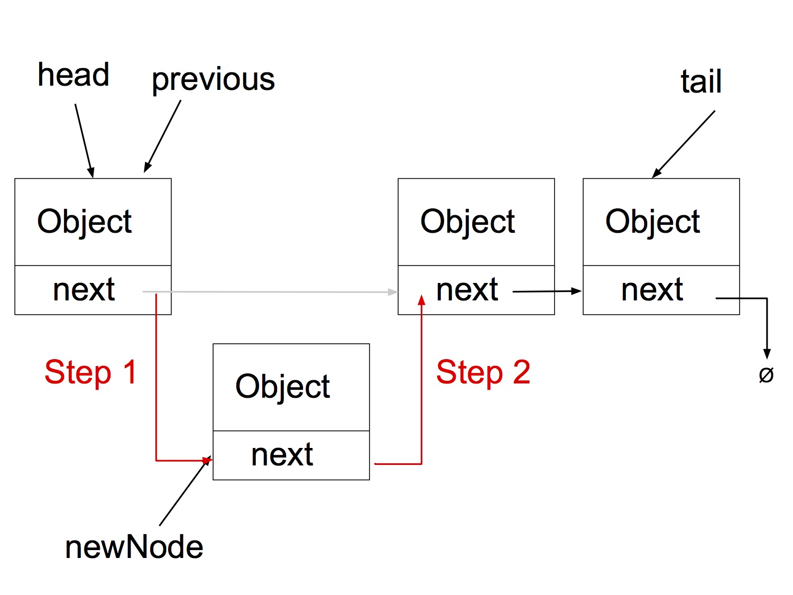
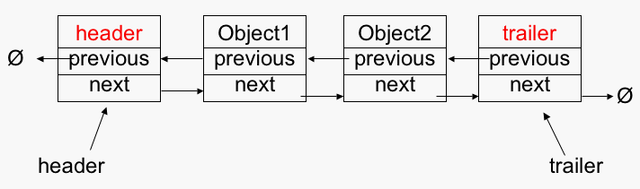

Linked Lists
============

## Overview

A linked list is a data structure that can store a collection of items. Like arrays, linked lists are used to store several objects of the same type. However, linked lists differ from arrays in the following ways:

- Linked lists are dynamically sized; they grow and shrink as nodes are added and removed and they do not require more memory than there are objects currently in the collection.
- The nodes of a linked list need not be stored contiguously in memory.
- Linked lists are not random access data structures; items are accessed sequentially, starting from the beginning of the list.

Linked lists are typically depicted as follows:



Each element of the list is referred to as a *node*. Each node contains an appropriately typed`Object` that represents the data stored in the node and a reference to the *next* node in the list. The last node in the list refers to `null`.

The first node in the list is referred to by a reference `head`. The last node in the list is optionally referred to by a reference `tail`.

## Implementation Details

To implement a Linked List in Java you must implement 2 classes -- one to represent a `Node` and one to represent the entire `LinkedList`.

#### `Node`
The `Node` class will have two data members, the `Object` and the `next` reference. It should also provide appropriate constructor(s) and get/set methods.

*What will be the type of the `next` reference?*

#### `LinkedList`

The `LinkedList` class will maintain appropriate references to the data stored in the list and will provide methods to add data, remove data, and access data.

*What are the data members of `LinkedList`?*

#### Insertion

Inserting at the head of a `LinkedList`:



1. Set the `next` reference of the new node to the node that `head` refers to 
  - `newNode.setNext(head)`

2. Set the `head` to refer to the new node
  - `head = newNode`

*What would happen if I reordered the previous steps?*

If you move the `head` reference before you've set another reference to refer to the first node in the list you lose the entire list.

*Does this algorithm work for the empty list?*

Not if you keep a `tail` reference. If you keep a `tail` reference, you need to test whether `head == null`. If so, set `head=tail=newNode`.

*What is the big-oh running time of the algorithm?*

The algorithm is O(1). It requires the same number of operations regardless of the size of the current list.

#### Inserting at the tail of a `LinkedList`

```
newNode.setNext(null)
tail.setNext(newNode)
tail = newNode
```

*What about inserting into an empty list?* 

#### Find

The general algorithm for searching a `LinkedList` is as follows:

```
current = head
//for each item in the list
while(current != null)
	//if the data matches the target
	if(target.equals(current.getData())
		return true
	//advance current
	current = current.getNext()
return false
```

*Does this algorithm handle the case when the target is not found?*

*What is the running time of the algorithm?*

#### Deletion

**Deletion of `head`**

```
//a constant time operation
if(head)
	head = head.getNext()
```

**Deletion of tail**

```
//if the list is empty, do nothing
if(!head)
	return
	
//if the list has one element, remove it
if(head.getNext() == null)
	head = tail = null
	
//start at the head of the list
current = head

//find the next-to-last element
//could also use condition current.getNext() != tail
while(current.getNext().getNext() != null)
	current = current.getNext()
current.setNext(null)
tail = current	
```

Notice that the delete tail operation iterates through the entire list. This requires visiting n nodes, so the operation requires linear time.

#### Arbitrary Insertion/Deletion

To insert in an arbitrary position in a linked list, for example in order to maintain a sorted list, you must find the node that comes before the node you wish to insert (`previous`) as shown below:



You can then execute the following algorithm:

```
newNode.setNext(previous.getNext())
previous.setNext(newNode)
```

This is an O(n) operation. As always, make sure to consider special cases!

Arbitrary deletion is a similar operation.

## Doubly Linked Lists

Doubly linked lists, as you might imagine, are linked lists wherein each node maintains a reference to the next node in the list and a reference to the previous node in the list. They have the advantage that you can move forward and backward in the list. So, removing the last node of the list is a constant time operation, not a linear time operation as with singly linked lists. However, maintaining two pointers for each node adds overhead with respect to memory used and maintenance of the references.



Often, doubly linked lists are implemented by using *sentinel nodes*. In the example above, the nodes `header` and `trailer` are dummy nodes that contain irrelevant data. This approach eliminates the need to deal with the empty list as a special case.

Consider how you would implement a doubly linked list and what the running time would be for each operation!